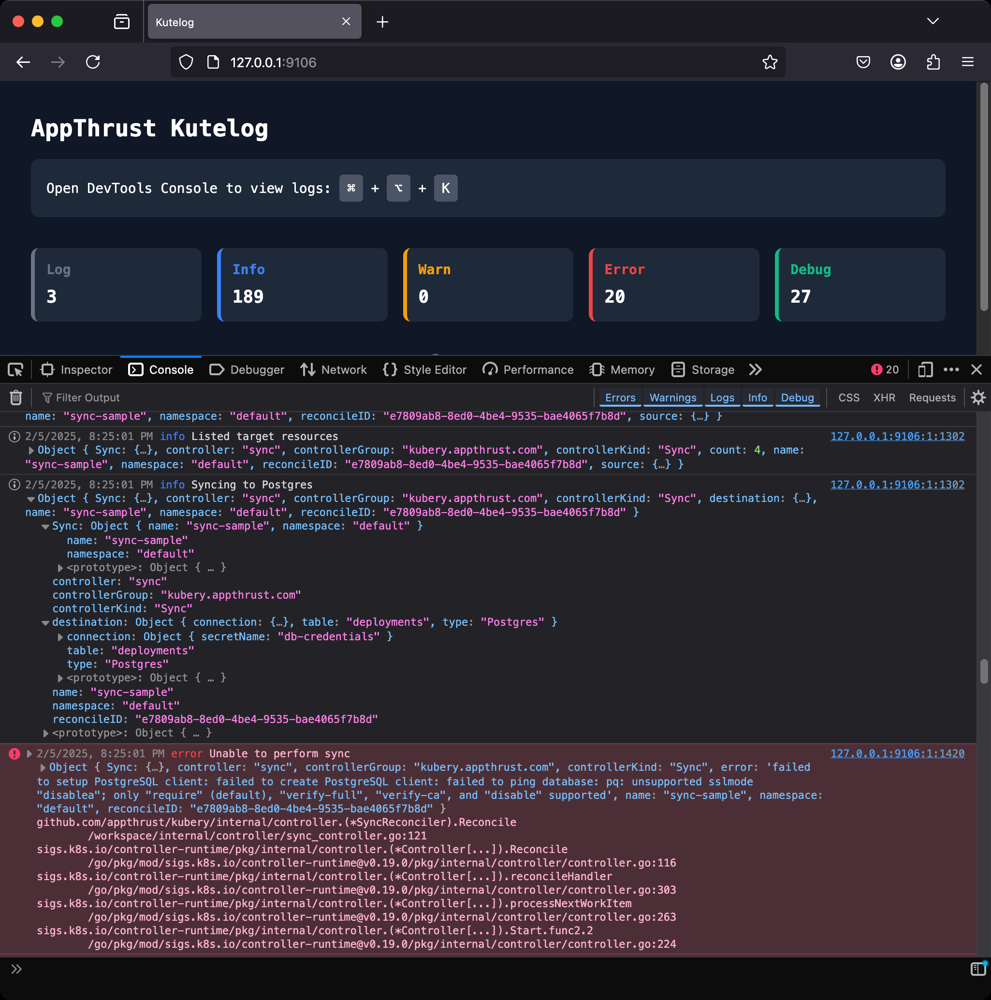

# 🌸 AppThrust Kutelog

[](https://github.com/appthrust/kutelog/releases/latest)
[](https://goreportcard.com/report/github.com/appthrust/kutelog)
[](https://github.com/appthrust/kutelog/blob/main/LICENSE)
[](https://github.com/appthrust/kutelog)
[](https://github.com/appthrust/kutelog/actions)

Kutelog is a development tool that leverages your browser's Console to make structured logs from Kubebuilder controllers easy to read in real-time. By utilizing the Console's powerful features, it helps developers see and analyze what their controllers are doing while they work on them.

Works with Chrome, Firefox, Safari, and Edge.



## 📦 Installation

### Using Homebrew

```bash
brew tap appthrust/tap
brew install kutelog
```

### Manual Installation

Download the latest binary from [GitHub Releases](https://github.com/appthrust/kutelog/releases).

## 🚀 Usage

### With Kubebuilder Controllers
```bash
make run 2>&1 | kutelog
```

### With Kubernetes Logs
```bash
kubectl logs -f deployment/myapp | kutelog
```

## 🤔 Why Browser Console?

Traditional CLI tools are great, but Browser Console offers unique advantages for structured logs:

- **JSON Handling**
  - CLI: Long, hard-to-read single-line JSON strings
  - Console: Interactive object explorer with expand/collapse functionality
  - Easily navigate through nested data structures

- **Filtering Capabilities**
  - CLI: Limited to grep-like text filtering
  - Console: Rich filtering options using built-in Console filters
  - Quickly switch between log levels (error, warn, info)

- **Search Experience**
  - CLI: Basic text search
  - Console: Advanced search with pattern matching
  - Search within specific log fields

## 💡 Console Tips

- **Log Level Filtering**
  - Use `error` to show only error logs
  - Use `warn` to show warnings and errors
  - Use `info` to show info, warnings, and errors
  - Click the level icons in the Console toolbar for quick filtering

- **Search Techniques**
  - Use `/pattern/` for regex search
  - Use `-word` to exclude entries containing "word"

- **Object Navigation**
  - Click the ▶ arrow to expand objects
  - Right-click properties for copy options

- **Console Management**
  - Click clear button (⊘ in Chrome/Edge, 🗑️ in Firefox/Safari) or press Cmd+K (macOS) / Ctrl+L (Windows/Linux) to clear console
  - Type `////////////////////////////////////` to add a visual separator

## ✨ Features

- 🔍 **Browser Console Benefits**
  - Interactive exploration of structured JSON data
  - Expand/collapse nested objects with ease
  - No more dealing with single-line JSON strings

- 🎯 **Powerful Filtering**
  - Filter by log levels using Console filters (error, warn, info)
  - Advanced text search capabilities
  - Focus on what matters to you

- 🔄 **Real-time Updates**
  - WebSocket-based live streaming
  - Automatic reconnection if connection is lost

## 🛠️ How to Use

1. Start Kutelog with your log stream
2. Open `http://localhost:9106` in your browser
3. Open DevTools Console (F12 or Cmd+Option+J)
4. Use Console filters to focus on specific log levels
